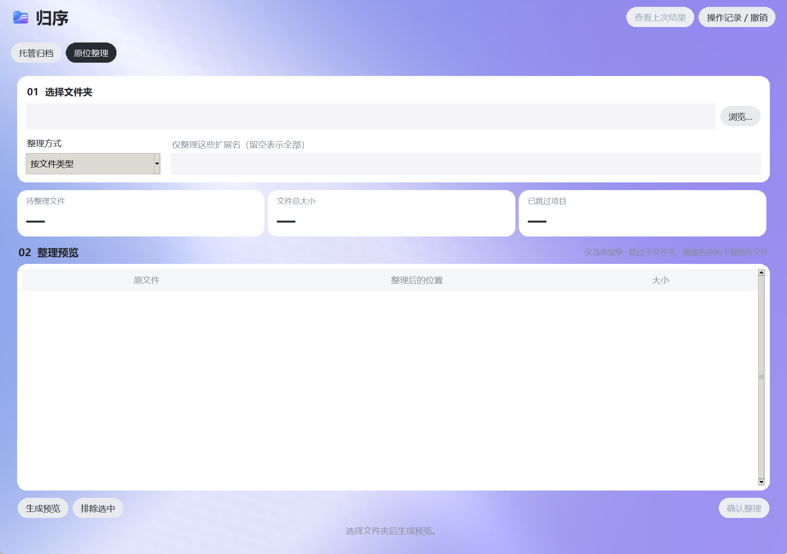

<div align="center">
  

  # 归序 · Orderly Files

  **把散乱文件，放回属于它们的位置。**

  一款在 Windows 本地运行的文件整理助手：自定义分类规则、托管多个文件夹、批量迁移，随时查看记录并撤销。

  [下载安装版](https://github.com/Asherzxh/orderly-files/releases/download/v1.0.0/Orderly-Files-Setup-v1.0.0.exe) · [下载便携版](https://github.com/Asherzxh/orderly-files/releases/download/v1.0.0/Orderly-Files-Portable-v1.0.0.zip) · [使用指南](#使用指南) · [从源码运行](#从源码运行)

  
  
  
</div>

## 一眼看懂

归序提供两种相互配合的工作方式：

| 工作方式 | 适合什么时候 | 做什么 |
| --- | --- | --- |
| **托管归档** | 有一个或多个长期使用的资料库 | 给每个目标文件夹设置自己的分类规则，再把其他位置的文件或文件夹拖进来，自动归档到相应子目录。 |
| **原位整理** | 只想整理当前杂乱的文件夹 | 在原文件夹内按类型、月份等规则建立分类目录并移动文件。 |

文件处理在本机完成，不需要登录或联网。归序不会上传文件内容。迁移前可选择预览，也可直接迁移；每次操作都有记录，符合条件时可撤销。

<div align="center">
  
  <br><sub>原位整理界面 · 蓝紫渐变、简洁圆角布局</sub>
</div>

## 下载与安装

请到 [Releases](https://github.com/Asherzxh/orderly-files/releases/latest) 下载，选择一种方式即可：

| 文件 | 用法 | 数据保存位置 |
| --- | --- | --- |
| [`Orderly-Files-Setup-v1.0.0.exe`](https://github.com/Asherzxh/orderly-files/releases/download/v1.0.0/Orderly-Files-Setup-v1.0.0.exe) | 双击安装；之后从开始菜单启动，可在 Windows 设置中卸载 | `%LOCALAPPDATA%\GuiyiOrganizer` |
| [`Orderly-Files-Portable-v1.0.0.zip`](https://github.com/Asherzxh/orderly-files/releases/download/v1.0.0/Orderly-Files-Portable-v1.0.0.zip) | 完整解压，再双击文件夹内的 `归序.exe` | 便携文件夹内的 `用户数据` |

两个版本均面向 **Windows x64**，运行时不需要安装 Python。安装包为离线安装，不会在安装过程中下载组件。当前安装包尚未数字签名，Windows 可能提示“未知发布者”；如需核对下载文件，可比对 Release 附带的 `SHA256.json`。

> 便携版请放在可写入的位置，保留整个文件夹一起移动。不要只从压缩包中打开单个 exe。

## 使用指南

### 1. 建立托管文件夹

在“托管归档”页，把已有文件夹拖到末尾的 **＋ 新增托管** 卡片，或点击 **新增托管 → 选择已有文件夹**。保存后便会建立托管。已有文件不会因添加托管而移动或删除。

每个托管目标都能独立设置子文件夹及分类规则。常用的“文件类型”可以直接使用；打开“高级选项”后，还能新建目标文件夹、批量创建子目录，以及选择下面的分类方式：

| 分类方式 | 示例 |
| --- | --- |
| 文件类型 | 文档、图片、视频等，可修改扩展名对应的目录 |
| 扩展名 | `pdf,docx` → “文档” |
| 文件名关键词 | `合同,协议` → “合同资料” |
| 修改月份 | `2026-09,2026-10` → “秋季资料” |

规则由上到下匹配，首个命中生效；未命中的文件进入指定兜底目录。编辑规则不会移动已经归档的文件，取消托管也不会删除文件。

### 2. 导入与迁移

可以把多个文件、多个文件夹，或两者混合拖到托管卡片；也可以拖到 **待分类区**，再选中目标。待分类区下方还有“导入文件”“导入整个文件夹”和“输入路径”入口，重复路径会自动去重。

选择目标后点击 **直接迁移**，即可按该目标的规则分类；如果想先检查目的地，则点击 **查看迁移预览**。可以开启“包含子文件夹”、按扩展名筛选，或在预览中排除个别文件。批量迁移会保留来源文件夹和空目录，不保留其内部层级；文件会按目标分类合并。跨磁盘迁移会先复制并校验，再移除源文件。

### 3. 自动监视与撤销

选中托管目标，点击 **自动监视**，指定另一个来源文件夹。软件运行期间，来源当前层级中稳定的文件会自动归档；可以暂停或移除监视。关闭软件后监视停止，重新打开后继续按保存的设置运行。来源和目标不能相同或相互包含。

在 **操作记录 / 撤销** 中查看每个文件的结果，并将可撤销的迁移恢复到原位置。如果文件在整理后已被修改，或原位置被其他文件占用，归序会保留现有文件并报告原因。撤销是移动恢复，不是文件内容备份。

### 4. 原位整理

切换到 **原位整理**，选择文件夹和整理方式，生成预览并确认。支持按文件类型、修改月份，或两者组合整理。原位整理默认只扫描所选文件夹的当前层级，不会递归处理子文件夹。

## 文件安全与边界

- 重名文件自动编号；预览后新出现的同名目标不会被覆盖。
- 如果源文件在预览后改变了大小、修改时间或文件身份，本次操作会跳过它。
- 默认跳过文件链接、以点开头的文件名，以及 `.tmp`、`.part`、`.crdownload` 等临时下载文件。
- 设置、待分类清单和撤销记录保存在本机；便携版的这些数据可随整个文件夹一起移动。
- 请勿用它整理系统目录、软件安装目录，或依赖固定相对路径的代码项目。

## 从源码运行

需要 Windows、Python 3.11+。仓库已经包含用于拖拽的 `tkinterdnd2` 组件；界面使用 Python 自带的 Tk。

```powershell
git clone https://github.com/Asherzxh/orderly-files.git
cd orderly-files
python app.py
```

也可以双击 `启动归序.bat`。`requirements.txt` 中的 Pillow 主要供截图工具使用，普通源码运行不依赖它。

运行自动测试：

```powershell
python -m unittest discover -s . -p 'test_*.py' -v
```

`测试/` 目录有可重新生成的手工测试材料和场景说明。`python smoke_ui.py` 可做界面与拖拽组件的基础检查。

### 重新构建 Windows 发布版

在隔离的 Python 环境中安装 `pyinstaller==6.22.3` 与 `Pillow==12.3.0`，将 Inno Setup 7 的 `ISCC.exe` 放在 `build/tools/inno/`，然后执行 `python build_release.py`。构建脚本会打包便携版、运行资源自检，编译 `归序安装包.iss` 并生成安装包、ZIP 和 SHA-256 摘要。`build/` 与 `release/` 是构建产物，不提交到源码仓库；正式二进制文件见 [Releases](https://github.com/Asherzxh/orderly-files/releases)。

## 开源许可

项目源码以 [MIT License](LICENSE) 发布。打包所用的 Python、Pillow、PyInstaller 和 tkinterdnd2 各自遵循其原有许可；下载包内附有第三方许可文本。欢迎提交问题和改进建议。

<sub>Orderly Files is a local-first Windows file organizer. It supports managed folders, configurable classification rules, batch migration, folder watching, operation history, and safe undo.</sub>
